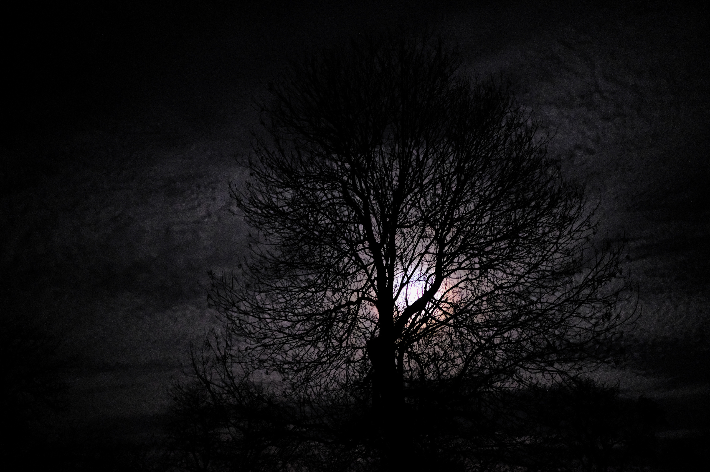

{}
Kdy: 1x měsíčně od 18:00, den v měsíci je určen dohodou

Kde: místo bude upřesněno

Téma: je dohodnuta na posledním kruhu

Cena: 100 Kč (platí se na místě)

Chceš se účastnit? [Napiš nebo zavolej mi](/#contact).
{}

Již tradičně se scházejí muži v kruhu ...

... muži, jenž chtějí poznat nejen sebe sama, ale i sdílet s ostatními své příběhy, těžkosti, úspěchy nebo třeba jen naslouchat a zažít sílu mužského společenství… 

Já sám se takhle setkávám měsíčně již 5-tým rokem a rozhodl jsem se vytvořit prostor pro setkávání mužů i z Uhříněvsi a okolí.

Jaké otázky se v kruhu mohou objevit?

* Co je mužská síla? Jaké má podoby?
* Jaký je můj osobní příběh?
* Co jsem musel překonávat v poslední době?
* O co jsem se mohl opřít (vně a uvnitř sebe)?
* Kam jsem se jako člověk, muž, partner, otec, lídr firmy, lídr školy, učitel, manažer, kolega, přítel, občan naší společnosti posunul?
* Na čem budu dál v životě stavět a čemu se díky tomu všemu otevírám do budoucna?

