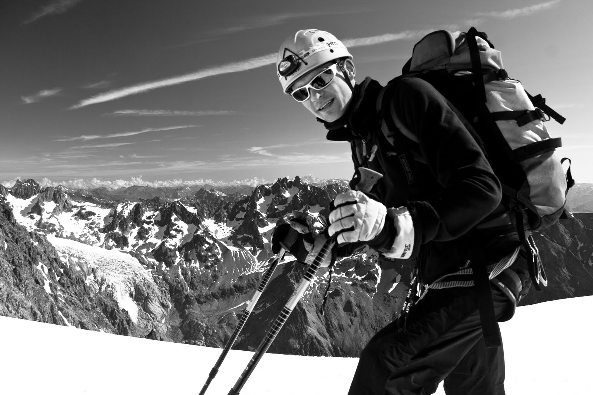

{}
Již dlouho chceš zkusit vysokohorský výstup nad 2 000 m. n. m. například v Rakousku nebo v Itálii?

Vylézt náročnější ferratu (D/E) nebo zkusit více-délkové lezení?

Nechceš si brát cestovku ale nemáš ve svém kruhu přátel nikoho, komu by jsi věřil, že Tě provede?

---

V horách jsem rád a ve výškách se cítím jako doma již 20 let.

Baví mě provázet skupiny a pomáhat jednotlivcům zdolávat jejich malé i větší výzvy a ukazovat jim, čeho všeho jsou schopný.

Chceš se účastnit? [Napiš nebo zavolej mi](/#contact).
{}

Jak na to?

1. Vyber si z níže uvedených lokací, ponech výběr na mně anebo mi navrhni vlastní.
2. Telefonicky nebo online se dohodneme na nezbytných detailech, já si ověřím, na co máš a troufáš si. Je možné se se budu chtít sejít osobně.
3. Zaplatíš 50% zálohu a dle zaslaného seznamu se můžeš začít připravovat, těšit se a sbírat dobrou náladu.

Cena za den na osobu: 1 000 Kč + doprava, ubytování a půjčovné materiálu.


 
Budu hlídat počasí, pošlu věci k zabalení, pomohu se zabezpečením potřebného materiálu i pojištěním a zajištěním ubytování.

Minimální počet účastníků 2, maximálně 8 osob.

---

**Osobně mohu doporučit následující místa**


| Stát | Vrcholy | Nadmorská výška | Orientační délka |
|--|--|--|--|
| Rakousko |Totes Gebirge: Grosser Priel nebo SpitzMauer| 2 500 m |  3 dni |
| Rakousko | WildSpitze | 3 770 m | 3 - 4 dny |
| Švýcarsko | masiv Silvretta s více vrcholy | nad 3 000 m | 4 - 5 dnů |
| Švýcarsko / Itálie | Matterhorn | 4 470 m | 4 - 5 dnů |


---

**Volné termíny**


| Sezóna | Typ výstupu | Typ ubytování | Volné termíny |
|--|--|--|--|
| Zima 2022 / 2023 | skiapl sněžnice | Winterraum zimní místnost v chatě | prosinec: 15-18.12 leden: 5-8.1, 19-22.1 únor: 3-5.2, 17-19.2 březen: 3-5.3, 17-19.3 duben: 31.3-2.4, 14-16.4, 28-30.4
| Léto 2023 | Turistika ferraty vícedélkové lezení | Společná nebo samostatná izba na chatě | květen: 12-14.5, 26-28.5 červen: 9-11.6, 23-25.6 zaří: 29.9-1.10 říjen: 13-15.10, 27-29.10 |


<!-- Inspirace: https://www.alpy4000.cz/nabidka/skialpovy-kurz-prvni-krucky-detail-612?tabs=plsd%3Acb1dd9af-d9d2-4ecc-a326-510028a5046d -->